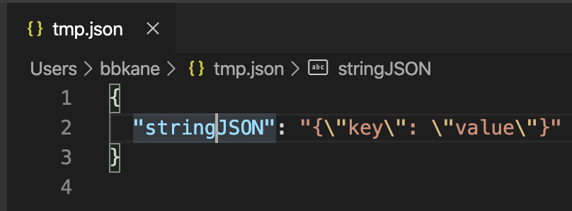

+++
title = "JSON JQ Snippets"
date = 2020-05-02
updated = 2020-05-02
aliases = [ "2020/05/02/JSON-JQ-Snippets.html" ]
+++

Here are some snippets for use with [`jq`](https://stedolan.github.io/jq/) and some other random JSON tips.

## See "path" to element

Open it in VS Code, put your cursor on the part you want to know about and
check out the breadcrumbs on the top of the window. In the following example,
you can see that I'm in the "stringJSON" element.



## Pretty-print nested stringified JSON

Why would anyone design JSON like this? I don't know but here's how to deal with it. From [Unix StackExchange](https://unix.stackexchange.com/a/415681/185953)

```
15:39:05.060 PDT mac02:~
$ cat tmp.json
{
  "stringJSON": "{\"key\": \"value\"}"
}
15:39:14.386 PDT mac02:~
$ cat tmp.json | jq '.stringJSON | fromjson'
{
  "key": "value"
}
```
