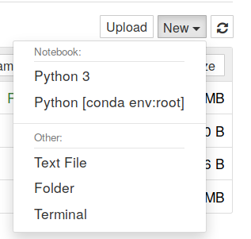
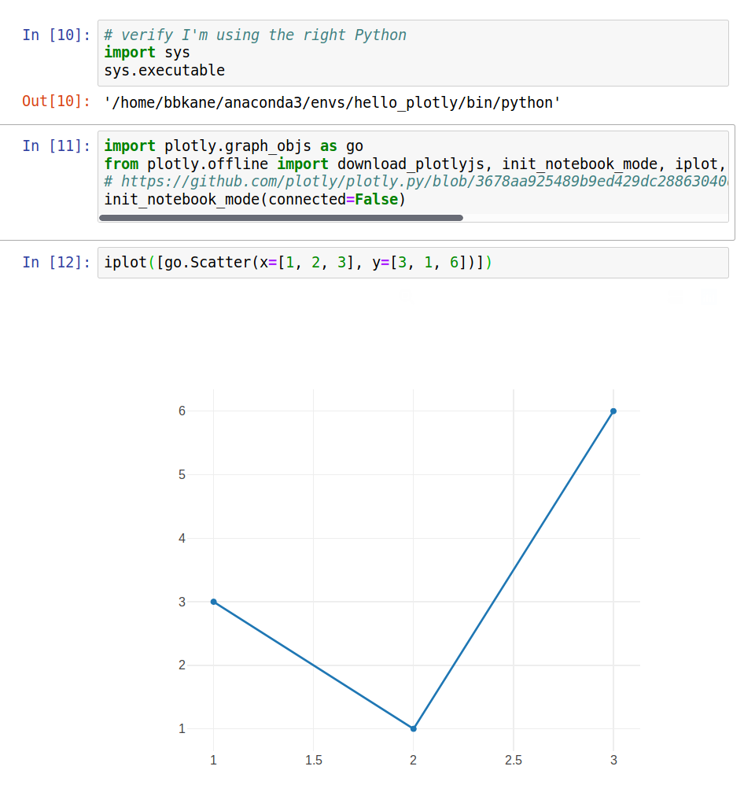

+++
title = "Jupyter Notebooks with Plotly"
date = 2019-04-18
updated = 2019-04-18
aliases = [ "2019/04/18/Jupyter-Notebooks-with-Plotly.html" ]
+++

Plotly is my current favorite Python graphing library. Here's how to use it with Jupyter Notebooks

# Install Anaconda Python

Install from [the website](https://www.anaconda.com/distribution/). If it gives
you the option to add Python to the PATH, I suggest you take it.

# Create the Conda Environment

[Create a local environment](https://docs.conda.io/projects/conda/en/latest/user-guide/tasks/manage-environments.html). Local environments don't clutter your system install with libraries you might not want later and are easy to create and delete.

This installs the Jupyter notebook interface and plotly. It can take a while to run, so be patient.

```bash
conda create -n hello_plotly python=3 nb_conda plotly
```

# Activate the environment

```
conda activate hello_plotly
```

`conda activate` and `conda deactivate` only work on conda 4.6 and later versions. For conda versions prior to 4.6, run:

- Windows: `activate` or `deactivate`
- Linux and macOS: `source activate` or `source deactivate`

I have an older version of `conda` and I'm on Linux, so I use `source activate hello_plotly`

# Run the notebook

```bash
jupyter notebook
```

This opens up a Jupyter notebook in your browser (usually at http://localhost:8888/tree ).

# Write the Notebook

- Create the Python notebook with the "Python 3" interpreter



- Verify that you're using the correct Python:

```python
# verify that I'm using the right Python
import sys
sys.executable'
```


- Import Plotly and initialize offline notebook mode

```python
import plotly.graph_objs as go
from plotly.offline import download_plotlyjs, init_notebook_mode, iplot, iplot
# https://github.com/plotly/plotly.py/blob/3678aa925489b9ed429dc28863040dbb391dadb1/plotly/offline/offline.py#L243
init_notebook_mode(connected=False)
```

- Plot something!

```python
iplot([go.Scatter(x=[1, 2, 3], y=[3, 1, 6])])
```

Here's a screenshot of my complete notebook for reference.


