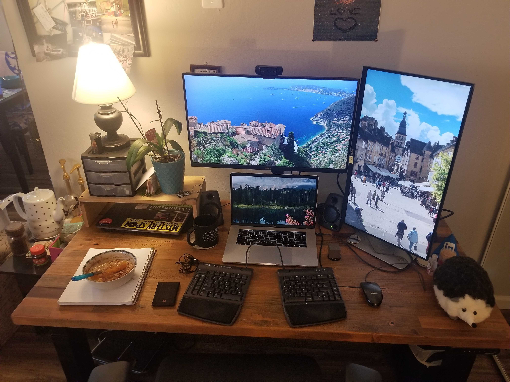

+++
title = "My Workstation"
date = 2020-11-15
updated = 2020-11-15
aliases = [ "2020/11/15/My-Workstation.html" ]
+++

- **Desk** - I bought an Uplift Desk from https://www.upliftdesk.com/:
  - Desktop Style: Rustic Reclaimed Fir (+$500.00) - in hindsight bamboo would have been cheaper, probably lighter, smoother (the reclaimed fir has small holes and such), and most likely looked almost as good or better in the low light.
  - Desktop Size: 60" x 30" - I really like this size. I have enough room for my laptop, monitors, and a notebook.
  - Frame: 4-Leg Commercial Adjustable-Height Standing Desk Frame - Black - This cost more, but I think it was worth it not to have a crossbar bumping against my legs or wobble when I stand
  - Advanced Digital Memory Keypad - Black ($29.00) - being able to save my height and switch between sitting and standing with the press of a button makes this super worth it. I am glad I got the keypad that is flush with th desk - I think I would have been annoyed by the (more expensive) one that juts out at an angle.
- **Mat** - UPLIFT Standing Desk Mat 18" x 30" x 3/4" - I got this for "free" with the desk and it's really squishy and comfy
- **Monitor Arm** - Discounted UPLIFT Range Single Monitor Arm - it doesn't wobble and holds up my monitor at a comfortable height
- **Monitors** - I have two Dell UltraSharp U2715H 27-Inch Screen LED-Lit Monitors from [Amazon](https://www.amazon.com/gp/product/B00P0EQD1Q/ref=ppx_yo_dt_b_search_asin_title?ie=UTF8&psc=1). I like the 2560x1440 resolution and the flexible stand it comes with, but the 60Hz refresh rate is overkill for my needs. I use the USBC -> DisplayPort cables from my doc (see below) to these becouase for some reason the USBC -> HDMI cable wasn't always recognized (usually fixed by rebooting my MacBook). My MacBook also forgets the orientation for these screens, so I use [displayplacer](https://github.com/jakehilborn/displayplacer) to save and restore position and orientation.
- **Webcam** - Logitech HD Pro Webcam C920 from [Amazon](https://www.amazon.com/gp/product/B006JH8T3S/ref=ppx_yo_dt_b_search_asin_title?ie=UTF8&psc=1). It gives a good image and I feel like being seen clearly while we're all work from home makes me seem more like a person and less like a blob on a screen.
- **Speakers** - Logitech Z130 Compact Speakers from [Amazon](https://www.amazon.com/gp/product/B003CP0OT2/ref=ppx_yo_dt_b_search_asin_title?ie=UTF8&psc=1) - they're cheap, small, and my tin ears wouldn't really appreciate something nicer.
- **Dock** - WAVLINK Thunderbolt 3 Docking Station from [Amazon](https://www.amazon.com/gp/product/B07N6552YK/ref=ppx_yo_dt_b_search_asin_title?ie=UTF8&psc=1) - this dock means I only have to plug one cord into my MacBook - this is really convenient if I want to work from the couch or switch out MacBooks.
- **Keyboard** - Kinesis Freestyle2 with the little wrist rests - I've really grown to like the split keyboard design and I got this keyboard for free from my work after an ergonomic assessment. My perfect keyboard would be a lot smaller, basically the [Apple Magic Keyboard](https://www.apple.com/shop/product/MLA22LL/A/magic-keyboard-us-english) but split. I'm a big fan of *thin* keyboards
- **Mouse** - A generic wired mouse. One of these day's I'll try a trackball - that seems like it would be fun
- **Chair** - A [Haworth Zody Task Chair](https://store.haworth.com/products/zody-office-chair-with-4d-arms) with the 4D arms. These are hella expensive, but I got a used one for $250 at the [Bay2Bay](https://bay2bayoffices.com/) warehouse in Santa Clara. It's nice for tall people (I'm 6ft) because the top doesn't have head cushion that would dig into my back.
