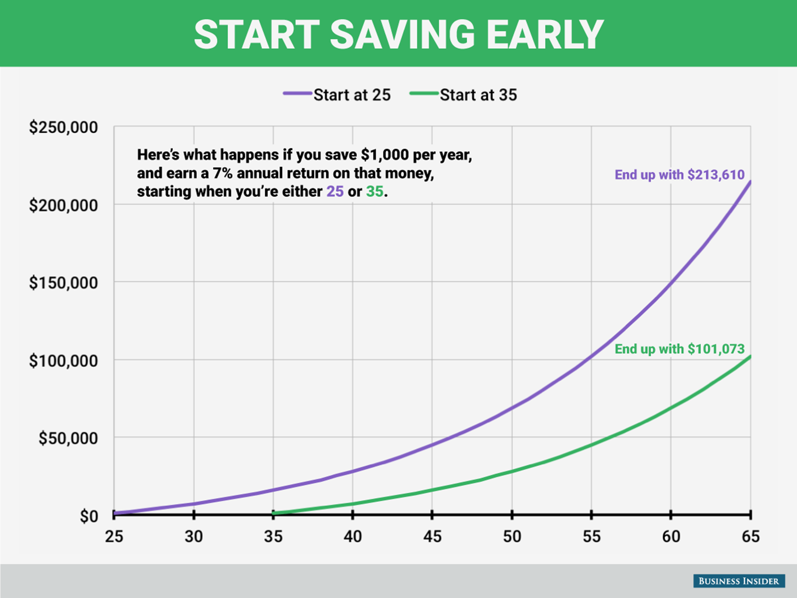

+++
title = "Saving For Retirement"
date = 2016-07-16
updated = 2016-12-25
aliases = [ "2016/07/16/Saving-For-Retirement.html" ]
+++

I got an email a couple of months ago from a coworker about saving for retirement that included
the following graph:



Being very interested in retiring someday, I wrote a quick python script to
calculate retirement:

```python
def retire(principal, num_years, rate):
    final_sum = 0
    for year in range(num_years):
        final_sum += principal
        final_sum += (final_sum * rate)
    return final_sum
```

Running it yields the expected values:

```python
retire(1000, 65 - 25, .07)
Out[2]: 213609.56982787763

retire(1000, 65 - 35, .07)
Out[3]: 101073.04136640529
```

What happens if I increase the principal? For kicks, let's increase it to 10000.

```python
retire(10000, 65 - 25, .07)
Out[4]: 2136095.698278777
retire(10000, 65 - 35, .07)
Out[5]: 1010730.4136640532
```

These are multiples of 10 from the original. When we multiply the principal by 10,
the final sum is also multiplied by 10. This becomes obvious when using the math formula for it:

For the following math, `P` is the principal, the amount we start off with and invest every year, `n` is the number of years, `r` is the interest rate, `R = 1 + r`, and `S_n` is the sum for year `n`

For the first year:

$$S_1 = P + Pr = PR$$

Continuing on:

$$S_2 = (S_1 + P)R = PR^2 + PR$$

$$S_3 = (S_2 + P)R = (PR^2 + PR + P)R = PR^3 + PR^2 + PR$$

... And we can easily see a pattern for any year:

$$S_n = PR + PR^2 + ...  +PR^{n-1} + PR^n$$

$$S_n = P(R + R^2 + ... + R^n)$$

$$S_n = P\sum_{1}^{n}R^n$$

So, as we can see, `P` really does simply multiply against the rate.
That sum is known as a [geometric series](https://en.wikipedia.org/wiki/Geometric_series),
 and we can reduce it to the following formula:

$$\frac{R^{n+1}-R}{R-1}$$

So our formula becomes:

$$S_n = P\frac{R^{n+1}-R}{R-1}$$

Finally, let's put back our `r` for comparison purposes:

$$S_n = P\frac{(1+r)^{n+1}-1-r}{r}$$

This is easily placed into Python:

```python
def retire_math(principal, num_years, rate):
    return principal * ((1 + rate)**(num_years + 1) - rate - 1) / rate
```

and easily tested:

```
retire_math(1000, 65 - 25, .07)
Out[14]: 213609.56982787818

retire_math(1000, 65-35, .07)
Out[15]: 101073.04136640551
```

There are differences between the two methods way after the decimal place,
but those are occurring because of
[floating point rounding errors](https://docs.oracle.com/cd/E19957-01/806-3568/ncg_goldberg.html).

From a programming perspective, `retire_math` (`O(constant)` time) should be a lot faster than `retire` (`O(n)` time),
but it is a lot less readable as well. For our use case it doesn't matter because both versions are fast enough.

`retire_math` also suffers in that it's input `rate` cannot be `0`, but `retire` can have a `0` input.


I'm out of time, but I want to look more at and expand this function. Some things I'd like to play with:

- Graphing it
- Seeing which input it's most 'sensitive' too. For example, if you can either increase the interest rate by .001, or increase your principal by $1000, which should you choose? (I think partial derivatives will come in handy here)
- extending it:
  - decrease/increase contributions over the years
  - decouple principal from contributions
  - Model leaving it alone for several years, then taking yearly sums out at a constant rate
