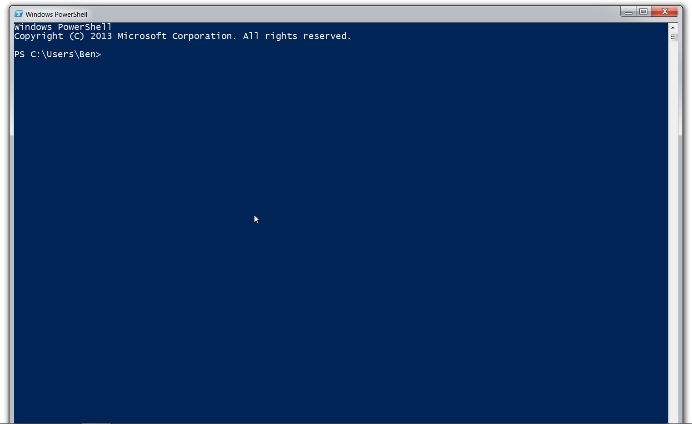
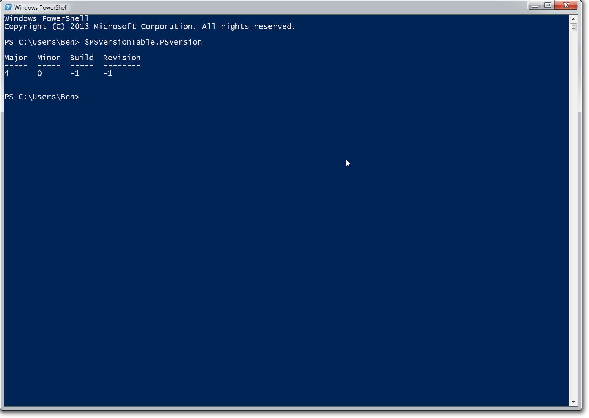
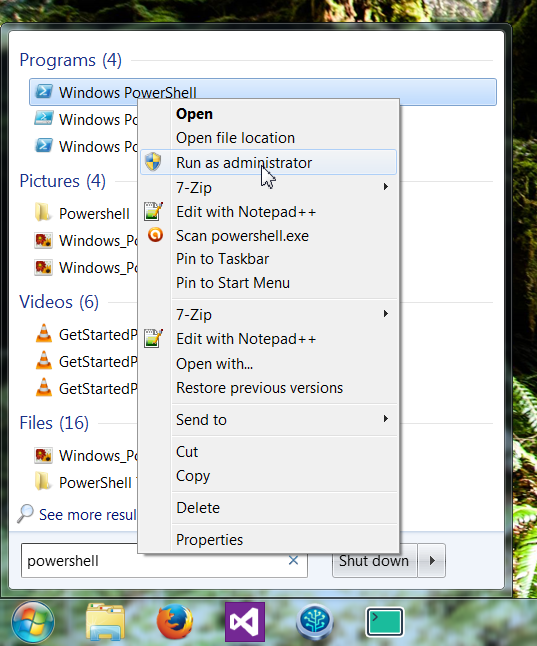
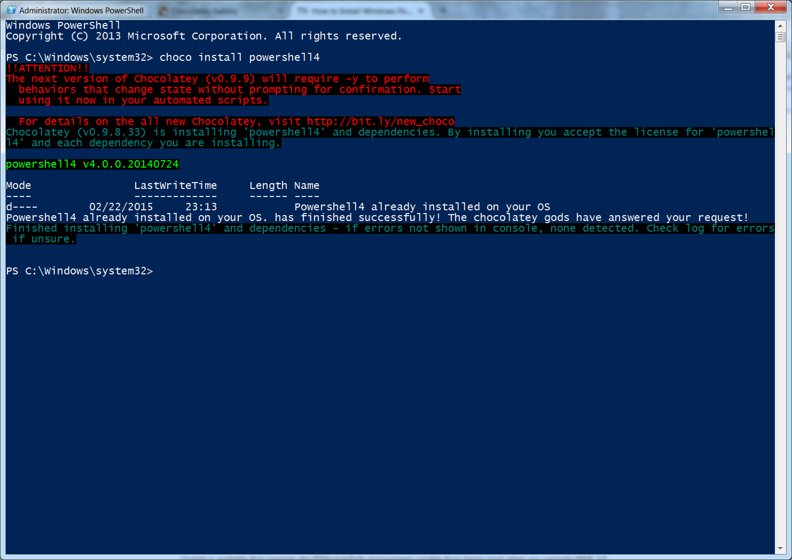
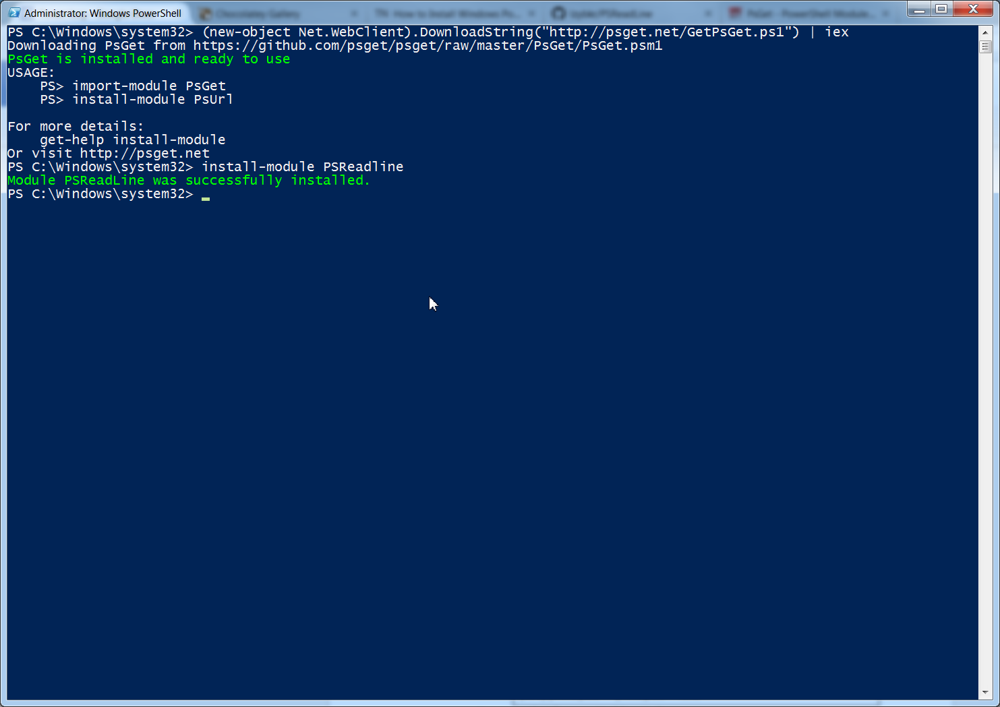
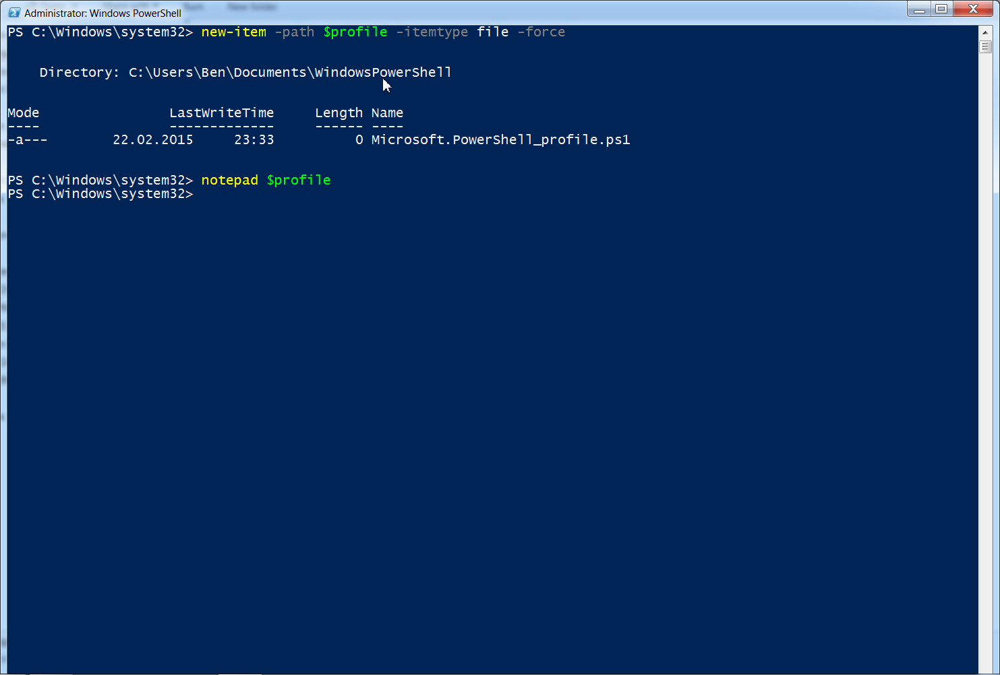
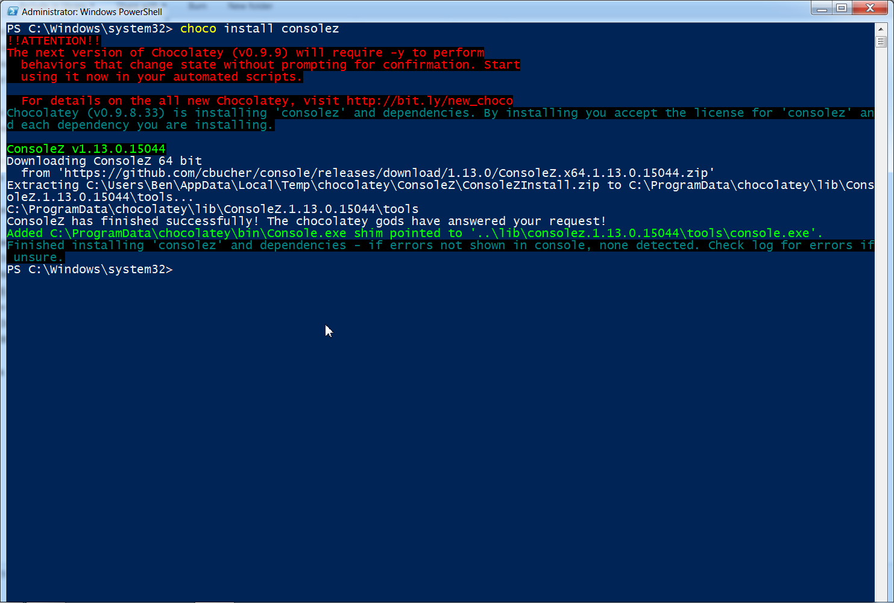
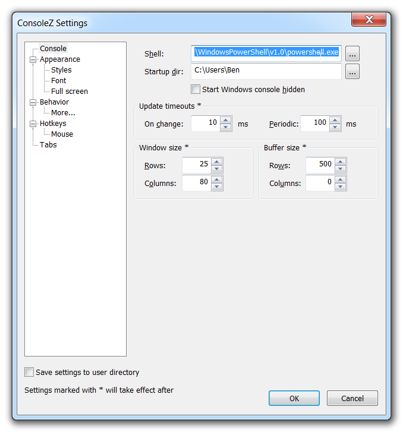

+++
title = "Setting Up PowerShell"
date = 2015-02-23
updated = 2016-12-25
aliases = [ "2015/02/23/Setting-Up-PowerShell.html" ]
+++

This is a post about how to use Powershell, the text-based interface to Windows. Now, why would we want to use Powershell? The biggest reason is automation. A person who knows Powershell can automate repetitive tasks away.

This is Powershell:


The good news is that Powershell is already on your Windows 7+ computer. To open it, click the start button (or press the Windows key), type “powershell”, and it should find it. Go ahead and open it.

We want to do is check the version of Powershell installed. To do this, type

```
$PSVersionTable.PSVersion
```

You should see a small text table with your version number. Like this:

If the “Major” field in that table is “4”, then you have the most up-to-date version (as of 2015-02-22). If not, and on Windows 7, this is probably the case, you will need to update it.

There are a couple ways of updating PowerShell. The most common way is to go through Microsoft’s website, but, in keeping with my prerogative to use the command line for everything, I’m going to show you how to update it through a Powershell utility named Chocolatey. Chocolatey is a third-party command line *package manager* for Windows. *Package manager* means it will install applications for you.

To install Chocolatey, follow the instructions on their [website](https://chocolatey.org/), which I explain in more detail below.

Open an **administrative** window of Powershell. To do this, search for it in the start menu again, but this time when you see the name, right click it and select *Run as Administrator*.


It will ask you for permission, which you must grant, and open a Powershell window that says “Administrator: Windows Powershell” in the title bar (at the very top left). Most of the tools you install from Powershell require Admin privileges.

Type

```
# allow install script
Set-ExecutionPolicy Unrestricted
```

to allow the installation script to run, then copy

```
iex ((new-object net.webclient).DownloadString('https://chocolatey.org/install.ps1'))
```

into Powershell (you must copy with the mouse instead of keyboard shortcuts) to install chocolatey. One command you should memorize is `choco /?`, which will list help for Chocolatey. For now, though, let’s update Powershell.

```
choco install powershell4
```

This makes sure you have Powershell’s dependencies (.Net version 4.5), and installs.


Mine is merely telling me I already have v4 installed.

Now that there is a modern version of powershell, we can start doing cool things! To enable syntax highlighting and some neat keyboard shortcuts, lets install [PSReadline](https://github.com/lzybkr/PSReadLine). Before we install PSReadline, though, we need to install [PSGet](http://psget.net/), which lets us download modules to Powershell.
In our Admin Powershell, copy

```
(new-object Net.WebClient).DownloadString("http://psget.net/GetPsGet.ps1") | iex
```

and hit enter. Now that it is installed, type

```
Install-Module PSReadline
```


After typing another command, you’ll immediately realise that it is in a nice shade of yellow now! Very cool. PSRreadline gives you many such tricks and you should [explore](https://github.com/lzybkr/PSReadLine) them all.

As soon as you restart Powershell you’ll notice that your fun bag of tricks is gone. `Import-Module PSReadline` must either be typed into the beginning of every console session, or it must be added to a configuration file. To make a config file that will run at the beginning of every session, type

```
new-item -path $profile -itemtype file -force
```

which will **erase** any config file in \Documents\WindowsPowerShell and create a new one, then

```
notepad $profile
```


At the beginning of this file, type

```
Import-Module PSReadline
```

This file is read every time PowerShell is opened, so you get syntax-highlighting automatically. My current $profile looks like:

```
# edit this file with: npp $profile
# reload profile in PowerShell with: .$profile
# get help with (including creation of ) profiles with: Get-Help about_Profiles

# PSReadline goodness (Ctrl + Space makes zsh-style completion guide)
Import-Module PSReadline

Set-Alias npp "C:\Program Files (x86)\Notepad++\notepad++.exe"
# Set-Alias notepad "npp"

# which from BASH
function which($name) {(Get-Command $name).path}
```

Finally, I don’t like the default Powershell app. It’s a calming shade of blue, but it’s impossible to resize properly. I use a different app called ConsoleZ. that has no qualms about sharing a screen with another app.

You’ve probably guessed how I’m going to install it.

```
choco install consolez
```



When you start up ConsoleZ, it boots to a DOS style shell, not the lovely PowerShell we want. Go to the toolbar on top and click *Edit*, then *Settings* to change this.

In the *Console* section of the settings, click the three dots next to “Shell:” and navigate to your PowerShell installation. If you don’t know where that is, use the command

```
(Get-Command powershell).path
```

 from a PowerShell window to find it.
 Mine is `C:\Windows\System32\WindowsPowerShell\v1.0\powershell.exe`. Restart the application, and Powershell is now loaded.

Okay! We now have a pretty good setup here. We have a new way to get apps (Chocolatey), a new way to get PowerShell modules (PSGet), syntax highlighting (PSReadline), and a resizeable app to use it all in (ConsoleZ). Not bad at all.
