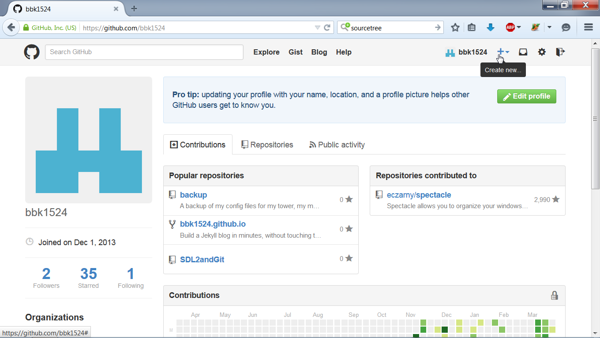
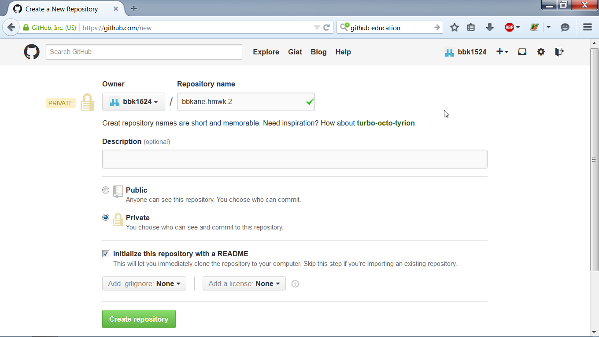
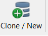
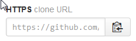
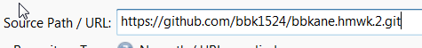
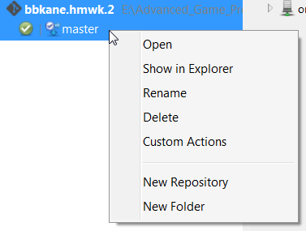
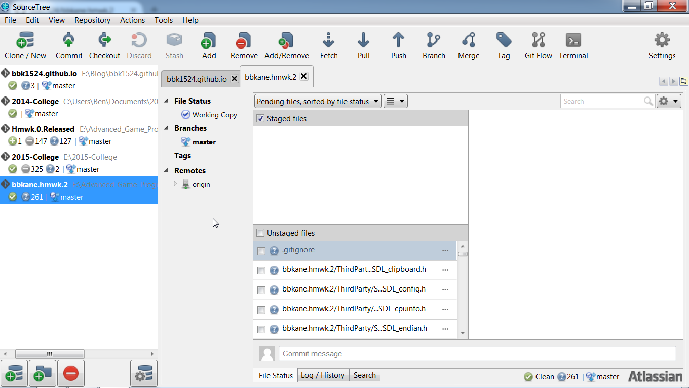
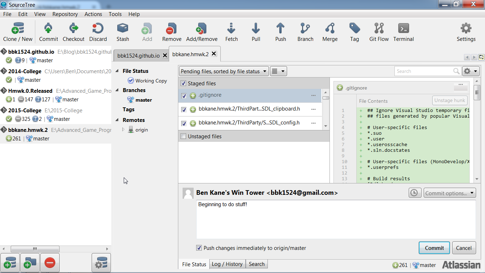
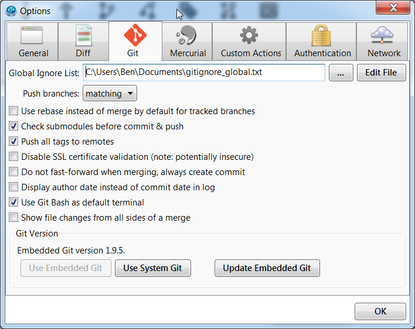

+++
title = "Visual Studio with SourceTree"
date = 2015-03-23
updated = 2016-12-25
aliases = [ "2015/03/23/Visual-Studio-with-SourceTree.html" ]
+++

When working on long or complicated projects, source control can save a lot of heartache. Git is becoming the standard source control tool, and I use a program by Atlassian called [SourceTree](http://sourcetreeapp.com/) to easily manage my repositories. In this blog post, I'm going to set up a repository (uesually shortened to "repo") on Github and SourceTree with a homework assignment from my Advanced Game Programming class.

The first step is to make a [GitHub](https://github.com/) account:

Once you're in, create a new repo

Name it and initialize with a README.md. This will ensure that we can immediately set it up with SourceTree. (I'm making mine private as well, because this will be a homework assignment for me. Students get five free private repos, and can sign up for this [here](https://education.github.com/)).

Now keep that webpage open and install Sourcetree from its [website](http://sourcetreeapp.com/).

Click *Clone/New*

Go back to the website where you crreated the repo and look for the *HTTPS clone URL* on the right. Click the button beside it to copy the address to your clipboard.

In SourceTree, copy that address to the field named *Souce Path/URL*.

Click the *Name* field to make sure it's populated, and make sure the destination folder is satisfactory. Now, click *Clone*!

We now have a practically empty ropo. Open it in Explorer:

Now you can put whatever you want in here, and it will be backed up.
Place something (I'm putting the beginnings of my homework) there and switch back to SourceTree. You'll see whatever you added.

Click *Unstaged files* to add 'em all, or right click a file and select *Ignore* if you don't want it included (creating a .gitignore file). Add a "Commit Message", check the box next to *Push changes immedeately to origin/master*, and click *Commit*.

Now, whenever you edit your project, SourceTree will know, and you can commit it. It's beyond the scope of this tutorial, but you will also be able to branch your project, revert to previous branches, and easily share your project with peers.

Some notes:

- If you get stuck in the GUI, and someone online offers a command-line solution to your problem, click the *Terminal* button to try it out.
- SourceTree also uses a global ".gitignore" file. Edit it from *Tools* (on the top menue bar), *Options*, and the *Git* tab. I had to edit it becasue my project included .dll files,

